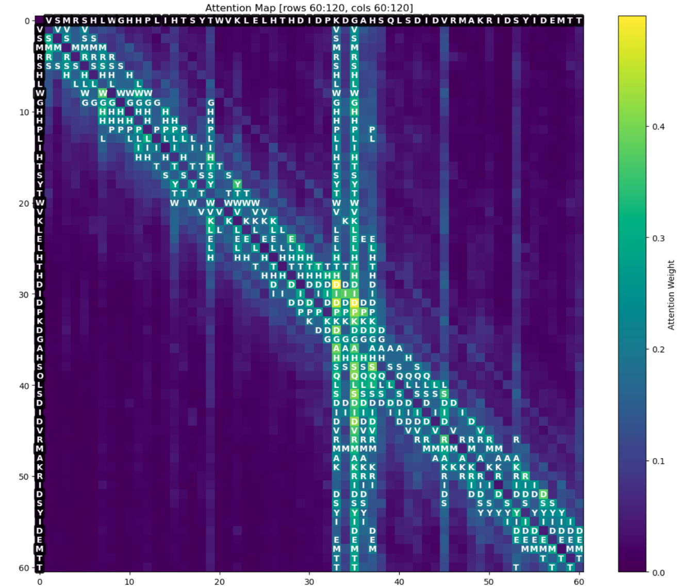

# Transformer-Based Enzyme Classification

ESM2 models for enzyme prediction and EC function classification with attention mechanism analysis.

## 🎯 Goal

Predict whether genes are enzymes and determine their EC commission number for a set of *S. cerevisiae* genes with unknown functionality.

## 🏗 Models

Fine-tuned ESM2 models for enzyme classification and EC function prediction.

## 🔍 Attention Analysis

- Attention map visualization 
- Zoom-in capability to examine amino acid relationship patterns
- Multi-layer attention extraction and aggregation




## 📊 Results

Test results for enzyme classification:
- Accuracy: 96.5%
- Specificity: 98.0% 
- Sensitivity: 94.4%

## 🗂 Dataset

Curated gene dataset from UniProt, BRENDA, and Enzyme.db.


## 📁 Contents

- Trained ESM2 models
- Attention analysis code
- Visualization tools
- Example attention maps

## Usage

Extract and visualize attention patterns from protein sequences to understand model predictions.

## 📄 Citation

If you use this work in your research, please cite:

### Dataset and Models
```bibtex
@dataset{fridman_2025_transformer_enzyme,
  author       = {Fridman, Naomi},
  title        = {Transformer-Based Enzyme Classification: Models and Dataset},
  year         = {2025},
  version      = {v1.0},
  publisher    = {Zenodo},
  doi          = {10.5281/zenodo.15640615},
  url          = {https://doi.org/10.5281/zenodo.15640615}
}

@software{fridman_2025_transformer_code,
  author       = {Fridman, Naomi},
  title        = {naomifridman/transformer-based-enzyme-classification: Initial Release: ESM2 Enzyme Classification},
  year         = {2025},
  version      = {v1.0.0},
  publisher    = {Zenodo},
  doi          = {[10.5281/zenodo.15640772]},
  url          = {https://github.com/naomifridman/transformer-based-enzyme-classification}
}

## Author
Naomi Fridman (NF Algorithms & AI) - [ORCID](https://orcid.org/0000-0003-3711-1655)
